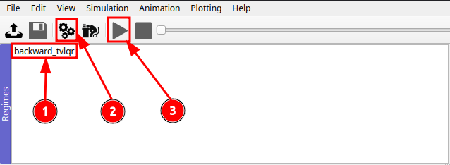

# n-trailer-lqr-control

Kinematic simulation and time-varying LQR control for a tractor + n-trailer chain.
From my Bachelor's thesis in Mechatronics (University of Innsbruck).

Backward driving along a time-reversed reference. TV-LQR tracks the reference in
closed loop; the same motion open-loop is unstable (jackknifing).

## Install

```bash
pip install -e .
```

Requires Python 3.10+. For the GUI: 

```bash
pip install -e ".[gui]"
```

## Quick Start

```bash
python scripts/demo_backward_driving.py   # writes results/backward_driving.png
```

## `scenario.yaml`

Geometry, trajectory, and initial perturbation. Both the demo script and the GUI
read this file. Commented examples for `bezier` and `circle` are in the file itself.

| Field | Meaning |
| ----- | ------- |
| `n_trailers` | Number of trailers (rebuilds symbolic model on next import) |
| `hitch_lengths_m` | Hitch lengths d₁…dₙ [m]; shorter lists repeat the last value |
| `axle_distances_m` | Axle distances l₂…lₙ₊₁ [m] |
| `deflection_deg` | Joint-angle offset at t=0 [deg] |
| `trajectory.type` | `waypoint`, `bezier`, or `circle` |
| `trajectory.T` | Simulation duration [s] — must match `end time` in `regimes/default.sreg` for the GUI |

The path is driven forward through the model, then reversed for backward driving.

### GUI

```bash
python scripts/run_gui.py
```

1. Select `backward_tvlqr` in **Regimes**
2. Click **Configure** (gear icon)
3. Click **Play**



## Thesis

*Lineare Ansätze zur Regelung eines Mehranhängersystems*, B.Sc. Mechatronics,
University of Innsbruck, 2025.
Not publicly available.

## License

MIT — see [LICENSE](LICENSE).
